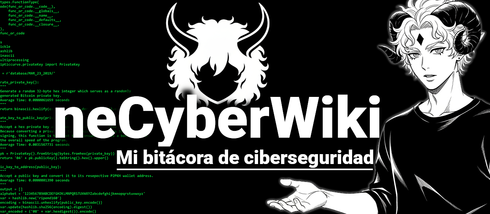

> ### Visita la [Página Web](https://netenebraes.github.io/neCyberWiki/).

La neCyberWiki es un proyecto tipo "Biblioteca Colaborativa" orientada a la ciberseguridad, el hacking ético, la informática y la privacidad digital. Su propósito es **centralizar conocimientos técnicos y prácticos, presentados de forma clara, libre y accesible**. 

**No es una academia**: es mi bitácora de aprendizaje, donde practico, documento y comparto para que cualquiera pueda aprender y aportar.

---
## ⚖️ Aviso legal

Todo el contenido de este repositorio tiene fines **educativos y formativos**. Las técnicas, conceptos y ejemplos descritos aquí deben practicarse **únicamente en entornos controlados, laboratorios personales, escenarios autorizados o sistemas de prueba diseñados para este propósito**.

El uso indebido de la información contenida en necyberwiki fuera de un contexto ético o legal es responsabilidad exclusiva del usuario. Los autores y contribuidores no se hacen responsables de posibles daños, sanciones o consecuencias derivadas del mal uso del material.

---
## 🚀 Objetivo

Crear una wiki de referencia para profesionales, estudiantes y entusiastas de la ciberseguridad, ofreciendo contenido técnico, guías prácticas, referencias, herramientas y metodologías de ataque y defensa, todo en un mismo lugar de fácil acceso y mantenimiento.

---
## 🧠 Contenido

El repositorio incluye:

- Conceptos fundamentales de ciberseguridad y hacking ético  
- Guías prácticas de pentesting (web, redes, sistemas)  
- Cheatsheets rápidas y resúmenes para uso en campo  
- Listados de herramientas comunes y sus usos  
- Ejemplos de reportes, análisis y metodologías  
- Recursos educativos gratuitos  

---
## 🛠️ Tecnologías y dependencias

El proyecto está realizado con [Obsidian](https://obsidian.md/) y [Quartz](https://github.com/jackyzha0/quartz) pero puede adaptarse fácilmente al motor de documentación de tu preferencia, como:

- Markdown simple.
- MkDocs con el tema Material for MkDocs.
- Docusaurus o similar para una interfaz más visual.

El proceso de documentación está siendo realizado de forma pública en [threads](https://www.threads.com/@netenebrae).

---
## 🤝 Contribuciones

Las contribuciones son bienvenidas. Puedes ayudar de las siguientes formas:

1. Corrigiendo errores o mejorando redacción técnica  
2. Añadiendo contenido nuevo y relevante  
3. Proponiendo mejoras en la estructura o navegación  
4. Reportando problemas o abriendo discusiones en la pestaña *Issues*  

Para contribuir:
```
git clone https://github.com/tuusuario/necyberwiki.git  
cd NeCyberWiki  
git checkout -b mejora-o-nueva-guia
```

Realiza tus cambios  
```
git add .  
git commit -m "Agrega nueva guía de pentesting web"  
git push origin mejora-o-nueva-guia
```

Después, abre un [Pull Request](https://github.com/NeTenebraes/neCyberWiki/pulls) con la descripción de tu aporte.

### 🧩 Estilo y pautas de redacción

- Prioriza la claridad técnica sobre la extensión  
- Usa formato Markdown limpio y sin exceso de formato  
- Cita las fuentes cuando sea necesario  
- Evita incluir material con derechos de autor no libres  
- Respeta la ética hacker: el conocimiento es libre, hacer daño es imperdonable.  

---
## 📜 Licencia

Este proyecto está distribuido bajo la licencia MIT. Consulta el archivo LICENSE para más detalles.

---
## ✨ Agradecimientos

A toda la comunidad hacker y de ciberseguridad que comparte su conocimiento abiertamente.
Especialmente a quienes dedican su tiempo a enseñar, investigar y mantener viva la cultura del hacking ético.
