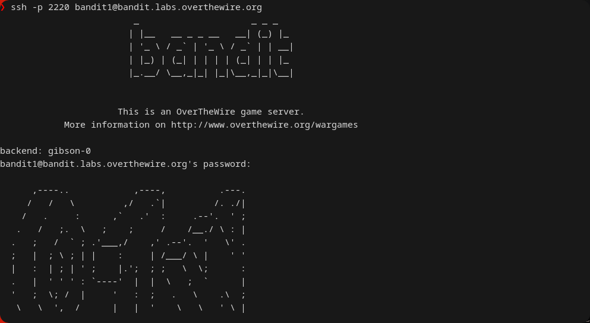
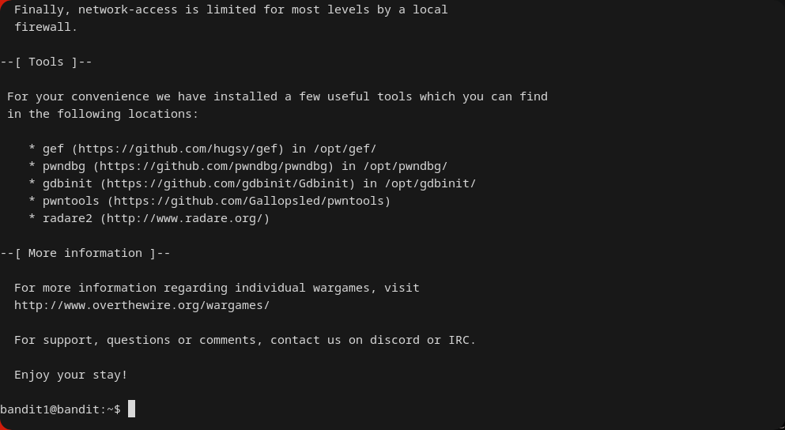
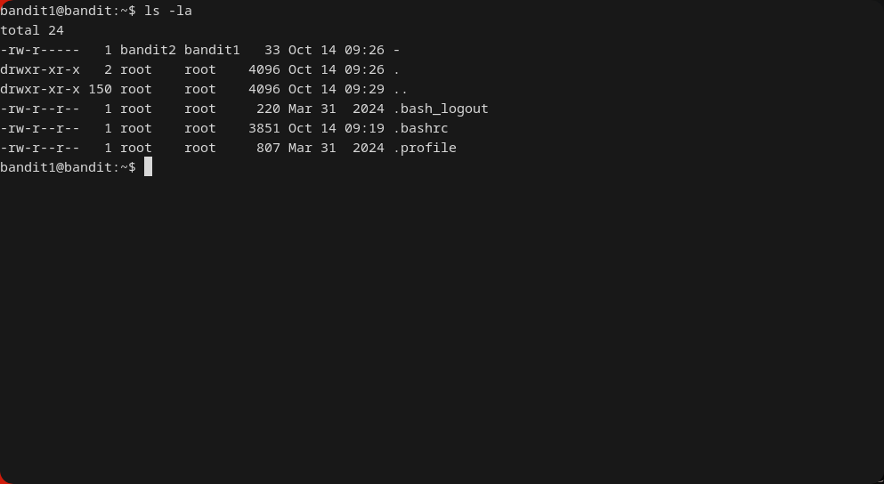
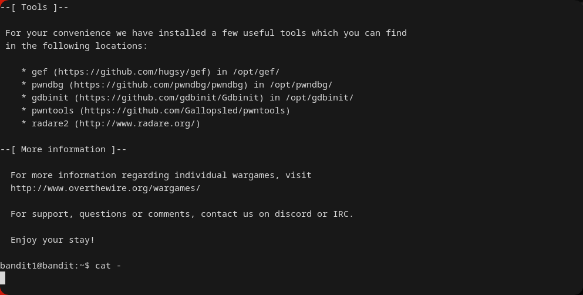
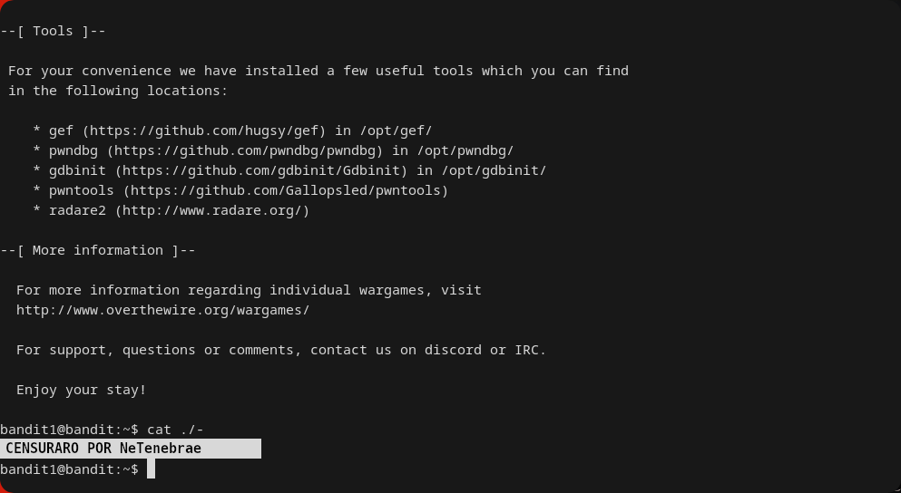

---
### Resumen
Este write-up explica cómo acceder a un archivo cuyo nombre es un guion (`-`), un carácter que los comandos de shell suelen interpretar como una opción o como la entrada estándar (stdin). La solución se basa en desambiguar el nombre del archivo utilizando una ruta relativa.

### Objetivo
La contraseña para `bandit2` está almacenada en un archivo llamado `-` en el directorio `home` del usuario `bandit1`.


### Contexto
Este nivel enseña una lección crítica sobre cómo el shell de Linux interpreta los argumentos. Muchos comandos tratan un guion solitario como una directiva para leer datos desde la entrada estándar en lugar de un archivo. Aprender a forzar la interpretación literal de un nombre de archivo es esencial para evitar comportamientos inesperados.

### Aplicación en Ciberseguridad
El mal manejo de nombres de archivo que parecen opciones es una fuente de vulnerabilidades. Un atacante podría crear un archivo llamado `-rf` en un directorio. Si un script de administrador mal programado ejecuta `rm *` en ese directorio, el shell podría expandir `*` a `-rf` y otros archivos, provocando que el comando `rm` ejecute una eliminación recursiva forzada. Saber cómo manejar estos nombres de forma segura (usando `./` o `--`) es una práctica de scripting defensivo.

### Comandos y Conceptos Relevantes
* **Ruta Relativa (`./`)**: Especifica una ruta desde el directorio actual. Anteponer `./` a un nombre de archivo fuerza al shell a tratarlo como una ruta y no como una opción.
* **Entrada Estándar (`stdin`)**: El flujo de entrada por defecto para un programa, que suele ser el teclado.
* **Delimitador `--`**: Un argumento especial que le indica a un comando que todo lo que sigue debe ser tratado como un nombre de archivo.

---
### Solución

1.  **Conectar al servidor como `bandit1`.**
```
ssh -p 2220 bandit1@bandit.labs.overthewire.org
```


2.  **Listar los archivos en el directorio `home`.**
```
ls -la
```


3.  **Intentar leer el archivo de la forma incorrecta (Opcional)**
```
cat -
```

    Si ejecutas `cat -`, el comando se quedará esperando una entrada del teclado porque interpreta el guion como la lectura de una **entrada estándar**. Tendrás que cancelarlo con `Ctrl+C`.

4.  **Leer el archivo de la forma correcta usando una ruta relativa.**
```
cat ./-
```

- Al anteponer `./` le indicas explícitamente al comando `cat` que `-` es un archivo en el directorio actual y no un argumento.
- **Contraseña Censurada** por [Reglas de OverTheWire.](https://overthewire.org/rules/)

### Métodos Alternativos

*   **Usar la ruta absoluta del archivo**:
```
cat /home/bandit1/-
```
---
### TIPS:
- Recuerda ayudarte de la tecla `TAB` para auto-completar comandos dentro de la terminal

### Errores Comunes y Soluciones

* **Error: El terminal se queda "congelado" después de ejecutar `cat -`**.
    *   **Causa**: El comando `cat` está esperando que escribas algo. No está congelado.
    *   **Solución**: Presiona `Ctrl+C` para cancelar el comando y volver al prompt del shell.

---
