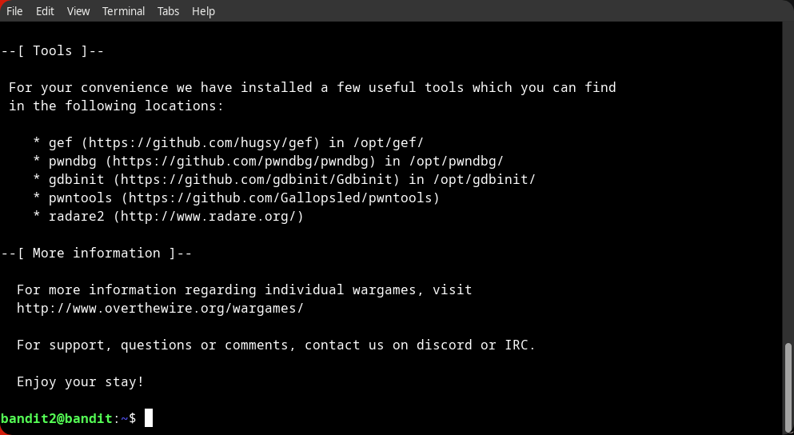
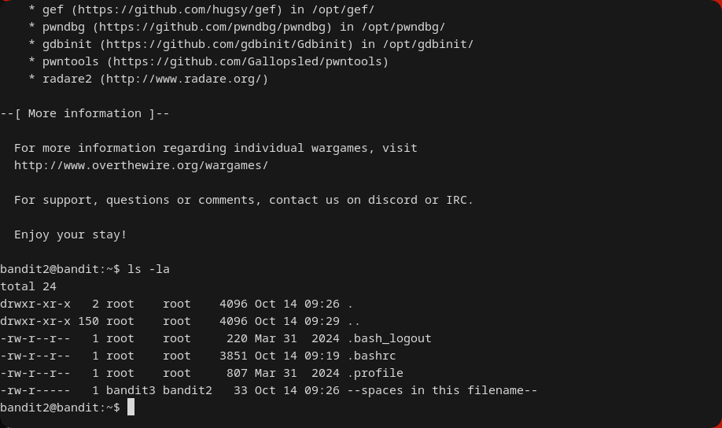
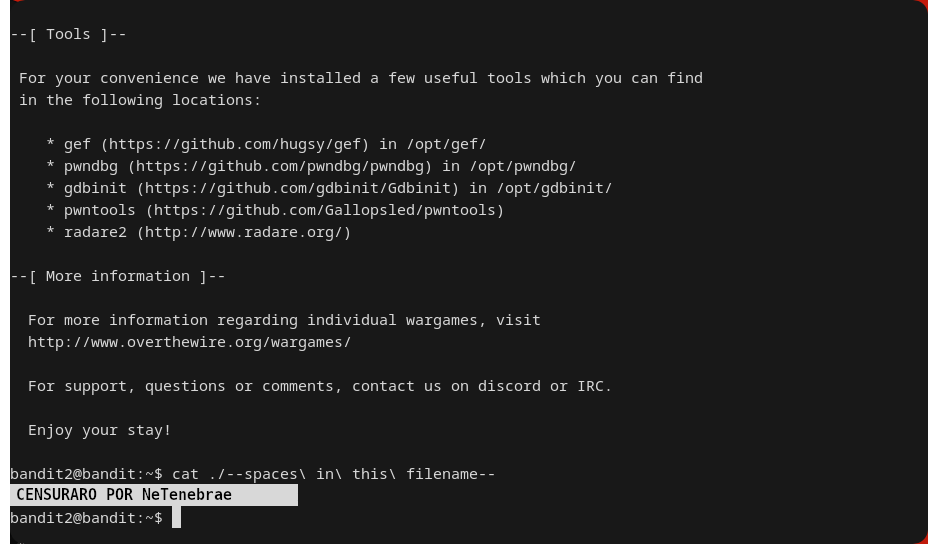

---
### Resumen
Este write-up aborda cómo manejar nombres de archivo que contienen espacios, lo que normalmente haría que el shell interpretara cada palabra como un argumento separado. Se demuestran tres técnicas para tratar el nombre del archivo como una sola entidad: comillas, escape de caracteres y autocompletado con TAB.

### Objetivo
La contraseña para `bandit3` se encuentra en un archivo llamado `--spaces in this filename--`.

### Contexto
El shell de Linux usa el espacio como delimitador por defecto para separar comandos y argumentos. Este nivel enseña las técnicas estándar para manejar nombres de archivo que contienen espacios, asegurando que el shell los trate como un único argumento.

### Aplicación en Ciberseguridad
El manejo incorrecto de espacios en nombres de archivo es una causa común de vulnerabilidades de "inyección de comandos" en scripts. Si un script ejecuta `rm $filename` y un atacante puede controlar `$filename` para que sea `nonexistent; whoami`, el script podría ejecutar el comando `whoami` si la variable no está entre comillas (`rm "$filename"`). Aprender a citar correctamente es una práctica de seguridad fundamental.

### Comandos y Conceptos Relevantes
* **Comillas Dobles (`"..."`)**: Agrupan los argumentos en una sola cadena.
* **Ruta Relativa (`./`)**: Especifica una ruta desde el directorio actual. Anteponer `./` a un nombre de archivo fuerza al shell a tratarlo como una ruta y no como una opción.
* **Comillas Simples (`'...'`)**: Agrupan los argumentos en una sola cadena literal.
* **Carácter de Escape (`\`)**: Anula el significado especial del carácter que le sigue.
* **Autocompletado (tecla `TAB`)**: Completa automáticamente nombres de archivo y comandos.

---
### Solución

1.  **Conectar al servidor como `bandit2`.**
```
ssh -p 2220 bandit2@bandit.labs.overthewire.org
```


2.  **Listar los archivos del home para ver el nombre exacto:**
```
ls -la
```


3.  **Leer el archivo usando comillas, escape de caracteres o autocompletado:**
```
cat ./--spaces in this filename--
```

	**Contraseña Censurada** por [Reglas de OverTheWire.](https://overthewire.org/rules/)

---

### TIPS:
- Usa siempre la tecla `TAB` para autocompletar rutas y nombres largos o con caracteres especiales.

### Errores Comunes y Soluciones

*   **Error: `cat: spaces: No such file or directory`**.
    *   **Causa**: No se usaron comillas ni caracteres de escape, por lo que `cat` intentó abrir tres archivos diferentes: `spaces`, `in`, y `this`.
    *   **Solución**: Encierra el nombre completo del archivo entre comillas (`"..."` o `'...'`) o usa la tecla `TAB` para que el shell lo haga por ti.

---
