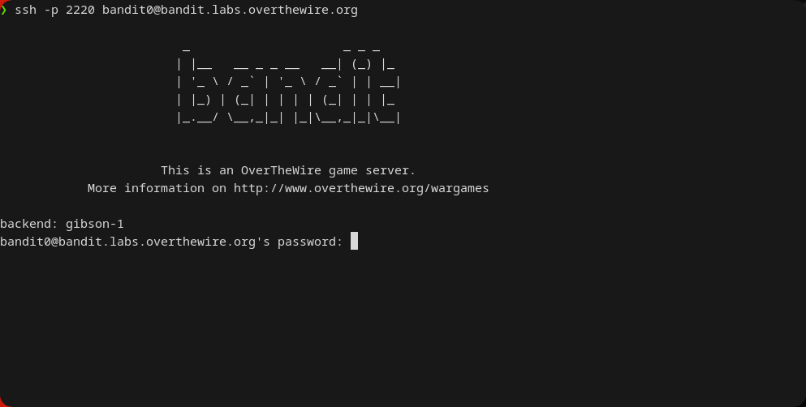
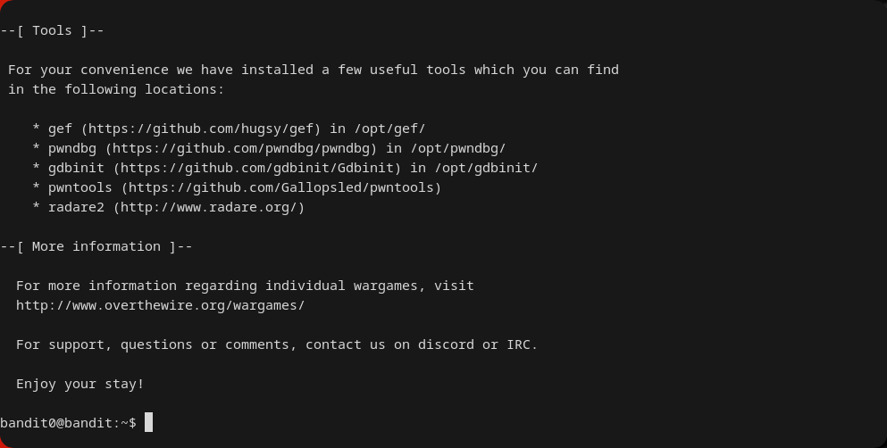

[OverTheWire](https://overthewire.org) ofrece wargames para aprender y practicar conceptos de seguridad en un entorno legal y controlado. El wargame **[Bandit](https://overthewire.org/wargames/bandit/)** está diseñado específicamente para principiantes absolutos. Su propósito es enseñar los comandos y conceptos fundamentales de la línea de comandos en sistemas Linux, que son prerrequisitos para wargames más avanzados.

El juego se estructura en niveles progresivos, iniciando en el Nivel 0. Cada nivel consiste en un desafío que, al ser resuelto, proporciona la información necesaria para acceder al siguiente, generalmente en forma de una contraseña para el siguiente usuario.

La metodología de aprendizaje se basa en la auto-investigación y la lectura de documentación. Cuando no sepas cómo proceder, utiliza los siguientes recursos:

* **`man <comando>`**: Muestra el manual de un comando específico. Proporciona una descripción completa, sus opciones y ejemplos de uso. Para salir del manual, presiona la tecla `q`.
* **`help <comando>`**: Para comandos que son *built-in* del shell (integrados en la terminal), `help` ofrece información sobre su uso.
* **Motores de búsqueda**: La habilidad para buscar información de manera efectiva es fundamental. Utilízalos para investigar comandos, técnicas o conceptos que no entiendas.

## Buenas Prácticas
* **Toma de notas**: Mantén un archivo local con las contraseñas de cada nivel. Si tu conexión se interrumpe, no tendrás que empezar desde cero.
* **Documenta el proceso**: Anota no solo la solución, sino también los comandos que probaste y por qué. Esto te ayudará a construir una metodología para resolver problemas más complejos.

----

## Conceptos Fundamentales

### ¿Qué es SSH?

SSH (Secure Shell) es un protocolo de red que permite establecer una conexión segura y cifrada entre dos máquinas. A través de esta conexión, se obtiene un *shell* (una terminal o línea de comandos) para ejecutar comandos en el sistema remoto como si se estuviera físicamente frente a él.

#### ¿Por qué el puerto 2220?

El puerto estándar para SSH es el 22. Utilizar un puerto no estándar como el `2220` es una medida básica de seguridad por oscuridad. Ayuda a evitar la detección por parte de escáneres automatizados que buscan servicios SSH en el puerto predeterminado.

## Requisitos
*   **Cliente SSH**: Sistemas como Linux, macOS o Windows (a través de PowerShell, WSL o CMD) lo incluyen por defecto. Puedes acceder al misto a través de su respectiva terminal.

---
# [Como Conectarte a bandit0 via SSH](https://overthewire.org/wargames/bandit/bandit0.html)

## Objetivo

El objetivo de esta introducción es que logres iniciar sesión en el servidor del juego utilizando el protocolo SSH con las credenciales aquí proporcionadas:
## Datos de Conexión

* **Host**: `bandit.labs.overthewire.org`
* **Puerto**: `2220`
* **Usuario**: `bandit0`
* **Contraseña**: `bandit0`
### Comandos Útiles para este Nivel.

* **[ssh](https://manpages.ubuntu.com/manpages/noble/man1/ssh.1.html)**: Programa cliente para el protocolo Secure Shell, utilizado para iniciar sesión de forma remota en otra máquina y ejecutar comandos.

---
## Solución 

Se utiliza el comando `ssh` para la conexión. Existen dos sintaxis equivalentes. 

### Método 1: Sintaxis `usuario@host` 

Este es el método más común. Se usa el flag `-p` para especificar el puerto seguido del usuario y el host unidos por un "`@`".

```
ssh -p 2220 bandit0@bandit.labs.overthewire.org
```

* **`ssh`**: Invoca el programa cliente de Secure Shell.
* **`-p 2220`**: Especifica que la conexión debe realizarse a través del puerto no estándar `2220`. Por defecto, SSH usa el puerto 22.
* **`bandit0@bandit.labs.overthewire.org`**: Define el usuario (`bandit0`) y el servidor al que te conectarás.

Tras ejecutar el comando, la terminal solicitará la contraseña (`password:`). Escribe `bandit0` y presiona Enter. No verás los caracteres mientras escribes; es un comportamiento normal de seguridad.



### Método 2: Sintaxis con flag `-l`

Una alternativa funcionalmente idéntica que utiliza el flag `-l` (*login name*) para definir el usuario.

```
ssh bandit.labs.overthewire.org -p 2220 -l bandit0
```

Tras ejecutar cualquiera de los comandos, el sistema solicitará la contraseña. Escribe `bandit0` y presiona Enter. La entrada de la contraseña es invisible por seguridad. Una vez autenticado, habrás completado el nivel.



---

## Errores Comunes y Soluciones

* **`ssh: command not found`**: El cliente OpenSSH no está instalado o no se encuentra en el PATH del sistema. En Windows, utiliza PowerShell, WSL o instala un cliente como Git Bash.
* **`Connection refused`**: El host de destino rechaza la conexión. Verifica que el número de puerto (`-p 2220`) sea correcto. Un firewall local o de red también podría ser la causa.
* **`Permission denied (publickey,password).`**: La contraseña ingresada es incorrecta. Vuelve a escribirla con atención.
* **`Host key verification failed`**: La firma criptográfica del servidor ha cambiado. Esto es normal si es la primera vez que te conectas o si el administrador del servidor la actualizó. Para solucionarlo, elimina la clave antigua de tu archivo de hosts conocidos: `ssh-keygen -R bandit.labs.overthewire.org`.

---
## Conceptos Adicionales | Material de lectura

La autenticación por contraseña es básica. En entornos profesionales se utiliza la autenticación por clave pública/privada, que es más segura.

* **[Secure Shell (SSH)](https://en.wikipedia.org/wiki/Secure_Shell)**: Arquitectura del protocolo, casos de uso y detalles del cifrado.
* **[Autenticación con claves SSH](https://www.digitalocean.com/community/tutorials/how-to-set-up-ssh-keys-on-ubuntu-20-04-es)**: Configurar más métodos de autenticación SSH.
* [How to use SSH with ssh-keys on wikiHow](https://www.wikihow.com/Use-SSH): Lectura adicional de como usar SSH Keys.
- [How to use SSH with a non-standard port on It’s FOSS](https://itsfoss.com/ssh-to-port/): SSH fuera del puerto 22.
